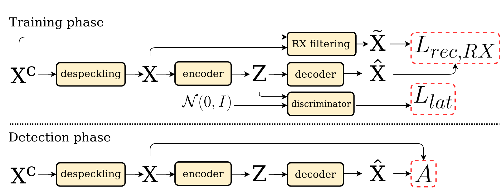

# SAR anomaly detection with adversarial autoencoder
Code related to the papers :
- M. Muzeau, C. Ren, S. Angelliaume, M. Datcu, and J.P. Ovarlez, “Self-supervised learning based anomaly detection in synthetic aperture radar imaging,” IEEE Open Journal of Signal Processing, pp. 1–9, 2022.
- M. Muzeau, C. Ren, S. Angelliaume, M. Datcu and J.P. Ovarlez, "Self-Supervised SAR Anomaly Detection Guided with RX Detector," 2023 IEEE International Geoscience and Remote Sensing Symposium, Pasadena, CA, USA, pp. 1918-1921



## Packages needed
 - Pytorch
 - Numpy
 - Matplotlib

## Description

This repository have the adversarial autoencoder with training and prediction phases.
It does not include :
- The despeckling algorithm
- The anomaly maps, which is an image of values between 0 and 1, 0 being a "normal" pixel and 1 an "abnormal" one.
- The data it have been trained on for confidentiality reasons

The input data are despeckled images with 4 polarizations. To make the algorithm work the 'norm' parameters have to be adapted to the desired images dynamic.

To train a neural network :

```
python train.py 
```
To make images reconstruction and compute the change detection :
```
python predict.py 
```

